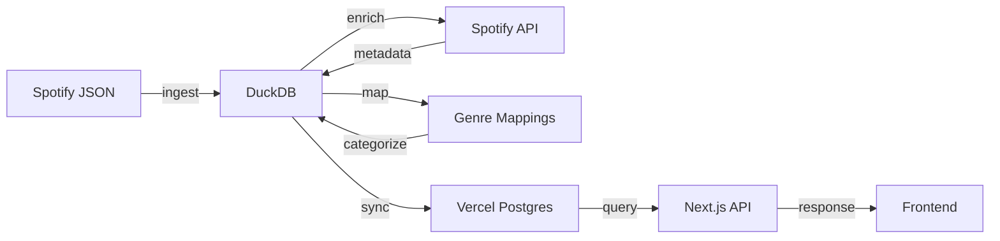

# Data Pipeline Architecture

How raw Spotify JSON files become queryable insights.

## Overview



**Flow:**
1. **Ingest** - Raw JSON → DuckDB (local)
2. **Enrich** - Spotify API → DuckDB metadata tables (optional)
3. **Map** - 452 subgenres → 28 broad categories (after enrichment)
4. **Sync** - DuckDB → Vercel Postgres (for production)
5. **Query** - API routes query database
6. **Display** - Frontend shows visualizations

## Scripts

### 1. `ingest_spotify.py` - Raw Data Ingestion

**Purpose:** Convert Spotify JSON exports into a queryable DuckDB database.

**Input:** `data_raw/Streaming_History_Audio_*.json`

**Output:** `data/spotify.duckdb` with `plays` table

**What it does:**
1. Reads all JSON files from `data_raw/`
2. Filters plays < 30 seconds (MIN_PLAY_DURATION_MS)
3. Converts UTC timestamps → Toronto timezone (America/Toronto)
4. Creates derived columns (date, year, month, year_month, dow, hour)
5. Creates empty enrichment tables (tracks, artists, audio_features)
6. Indexes for fast queries

**Run it:**
```bash
python scripts/ingest_spotify.py
```

**Configuration:**
```python
# scripts/ingest_spotify.py
LOCAL_TIMEZONE = ZoneInfo("America/Toronto")  # Change if needed
MIN_PLAY_DURATION_MS = 30000  # 30 seconds
```

**Schema created:**
- `plays` table - All listening history
- `tracks` table - Track metadata (empty until enriched)
- `artists` table - Artist metadata (empty until enriched)
- `audio_features` table - Audio characteristics (empty until enriched)
- `genre_mappings` table - Subgenre → broad genre mappings (empty until seeded)

See [Database Architecture](../architecture/database.md) for full schema.

---

### 2. `enrich_metadata.py` - Spotify API Enrichment

**Purpose:** Add metadata from Spotify API (genres, release years, popularity).

**Requirements:**
- Spotify Developer account
- Client ID and Secret

**Environment variables:**
```bash
export SPOTIFY_CLIENT_ID=your_client_id
export SPOTIFY_CLIENT_SECRET=your_client_secret
```

**What it does:**

#### Track Enrichment
1. Gets unique `spotify_track_uri` from plays
2. Calls Spotify API in batches of 50
3. Extracts:
   - Release date/year/decade
   - Popularity score
   - Album info
   - Explicit flag
   - Duration
4. Stores in `tracks` table

#### Artist Enrichment
1. Gets unique `artist_name` from plays
2. Searches Spotify API for each artist
3. Extracts:
   - Genres (comma-separated)
   - Popularity score
   - Follower count
   - Spotify artist ID
4. Stores in `artists` table

**Run it:**
```bash
# Set credentials first
export SPOTIFY_CLIENT_ID=xxx
export SPOTIFY_CLIENT_SECRET=yyy

# Run enrichment
python scripts/enrich_metadata.py
```

**Performance:**
- Tracks: ~50 per second (API batch limit)
- Artists: ~1 per second (requires search)
- 10,000 tracks: ~3-4 minutes
- 5,000 artists: ~90 minutes

**Rate limiting:**
- Script respects Spotify API rate limits
- Automatically retries on errors
- Progress tracking with counts

**Features unlocked:**
- Genre distribution chart
- Release year/decade analysis
- Popularity insights

---

### 3. `seed_genre_mappings.py` - Genre Categorization

**Purpose:** Map Spotify's 452+ granular genres into 28 manageable broad categories.

**Requirements:**
- Must run after enrichment (needs genres in `artists` table)

**What it does:**
1. Reads all unique genres from `artists` table
2. Applies pattern-based categorization rules
3. Maps each subgenre to a broad category:
   - Rock (49 subgenres)
   - Electronic/Dance (66 subgenres)
   - Pop (41 subgenres)
   - Jazz (29 subgenres)
   - And 24 more categories
4. Stores mappings in `genre_mappings` table

**Run it:**
```bash
python scripts/seed_genre_mappings.py
```

**Performance:**
- Instant (<1 second)
- Re-runnable (clears and rebuilds)

**Features unlocked:**
- Broad genre analysis via `/api/genres-broad`
- 93.8% reduction in genre complexity (452 → 28)
- Easier visualization and insights

**Customization:**
Edit `categorize_genre()` function to adjust mappings.

See [Genre Mappings Guide](../guides/genre-mappings.md) for details.

---

### 4. `sync_to_postgres.py` - Sync to Production

**Purpose:** Copy DuckDB data to Vercel Postgres for serverless deployment.

**Requirements:**
- Vercel Postgres database connected to project
- `POSTGRES_URL` environment variable

**What it does:**
1. Connects to local DuckDB (read-only)
2. Connects to Vercel Postgres
3. Drops and recreates all tables
4. Uses PostgreSQL `COPY` for bulk loading
5. Creates indexes
6. Commits transaction

**Run it:**
```bash
# Set Postgres URL
export POSTGRES_URL="postgres://..."

# Or use from .env.local
python scripts/sync_to_postgres.py
```

**Performance:**
- 80,000+ rows per second using COPY
- 77,800 plays sync in ~1 second
- Single operation (Vercel billing)

**Why it's fast:**
- Uses bulk COPY instead of INSERT
- Single transaction
- Minimal network round-trips

**Tables synced:**
- plays
- tracks
- artists
- audio_features
- genre_mappings (new!)

**When to run:**
- After ingesting new data
- After enrichment and genre mapping
- Before deploying to Vercel

---

### 5. `run_full_pipeline.sh` - Complete Pipeline (Recommended)

**Purpose:** Run the entire data pipeline in one command.

**What it does:**
```bash
#!/bin/bash
# 1. Activate Python venv
source venv/bin/activate

# 2. Ingest raw data
python scripts/ingest_spotify.py

# 3. Enrich metadata (if credentials available)
if credentials exist:
  python scripts/enrich_metadata.py
  python scripts/seed_genre_mappings.py
else:
  show warning about missing credentials
fi
```

**Run it:**
```bash
# Full pipeline (default: with enrichment)
./scripts/run_full_pipeline.sh

# Skip enrichment
./scripts/run_full_pipeline.sh --no-enrich

# Help
./scripts/run_full_pipeline.sh --help
```

**Credentials:**
Automatically loads from `.env` file if present.

---

### 6. `run_enrichment.sh` - Enrichment Only

**Purpose:** Run enrichment + genre mapping on already-ingested data.

**What it does:**
```bash
# 1. Load credentials from .env
# 2. Run enrichment
python scripts/enrich_metadata.py

# 3. Map genres
python scripts/seed_genre_mappings.py
```

**Run it:**
```bash
./scripts/run_enrichment.sh
```

---

### 7. `run_pipeline.sh` - Basic Pipeline (Legacy)

**Purpose:** Basic ingestion with optional enrichment (legacy).

**Note:** Use `run_full_pipeline.sh` instead (includes genre mapping).

**What it does:**
- Ingests data
- Optionally enriches if `ENRICH=true`
- Does NOT include genre mapping

**Run it:**
```bash
# Basic (no enrichment)
./scripts/run_pipeline.sh

# With enrichment (missing genre mapping step)
ENRICH=true ./scripts/run_pipeline.sh
```

---

## Data Quality

### Filtering

**30-Second Rule:**
Plays < 30 seconds are filtered out:
- Skipped tracks
- Accidental plays
- Quick previews
- Follows Spotify royalty standard

### Timezone Conversion

**UTC → Local Time:**
Spotify provides UTC timestamps. We convert to local time:
- Accurate hour-of-day analysis
- Correct day-of-week patterns
- Configured in `ingest_spotify.py`

```python
LOCAL_TIMEZONE = ZoneInfo("America/Toronto")
```

See [Timezone docs](../archive/TIMEZONE.md) for details.

---

## Workflow Examples

### Fresh Setup (Recommended)
```bash
# 1. Full pipeline (ingest + enrich + map genres)
./scripts/run_full_pipeline.sh

# 2. Sync to Postgres
python scripts/sync_to_postgres.py

# 3. Deploy
git push origin main
```

### Fresh Setup (Without Enrichment)
```bash
# 1. Basic ingest only
./scripts/run_full_pipeline.sh --no-enrich

# 2. Sync to Postgres
python scripts/sync_to_postgres.py

# 3. Deploy
git push origin main
```

### Update with New Data
```bash
# 1. Add new JSON files to data_raw/
# 2. Re-run full pipeline
./scripts/run_full_pipeline.sh

# 3. Re-sync
python scripts/sync_to_postgres.py

# 4. Deploy
git push
```

### Add Enrichment to Existing Data
```bash
# 1. Get Spotify API credentials
# 2. Add to .env file:
#    SPOTIFY_CLIENT_ID=xxx
#    SPOTIFY_CLIENT_SECRET=yyy

# 3. Run enrichment (includes genre mapping)
./scripts/run_enrichment.sh

# 4. Sync to Postgres
python scripts/sync_to_postgres.py

# 5. Deploy
git push
```

### Update Genre Mappings Only
```bash
# If you customize categorization logic
python scripts/seed_genre_mappings.py

# Sync to Postgres
python scripts/sync_to_postgres.py
```

---

## Troubleshooting

### "ModuleNotFoundError: No module named 'duckdb'"
Activate venv:
```bash
source venv/bin/activate
```

### "POSTGRES_URL environment variable not set"
Set it:
```bash
export POSTGRES_URL="postgres://..."
```

### Enrichment is very slow
- Tracks: ~50/sec is normal (API limit)
- Artists: ~1/sec is normal (requires search)
- Run overnight for large datasets

### "Rate limit exceeded" from Spotify
- Script handles this automatically
- Will retry after backoff
- No action needed

---

## See Also

- [Database Architecture](./database.md) - Schema and tables
- [API Routes](./api-routes.md) - How data is queried
- [Enrichment Guide](../guides/enrichment.md) - Detailed enrichment instructions

