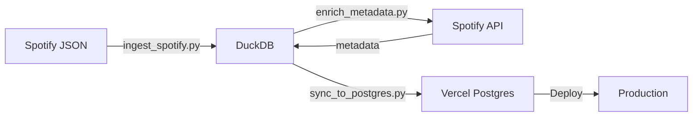

# Database Architecture

This project uses a **dual-database architecture** optimized for both local development and production deployment.

## Overview

```
Local Development:     DuckDB (data/spotify.duckdb)
                       ↓
Production (Vercel):   Vercel Postgres
```

## Why Two Databases?

### DuckDB (Local)
- ✅ **Extremely fast** analytical queries
- ✅ **Zero configuration** - just a file
- ✅ **No network latency**
- ✅ **Perfect for ETL** (data ingestion & enrichment)
- ❌ Can't run on serverless (native binaries)

### Vercel Postgres (Production)
- ✅ **Serverless-compatible** - works on Vercel
- ✅ **Auto-scaling** and managed backups
- ✅ **Low latency** globally distributed
- ✅ **Connection pooling** built-in
- ❌ Operations count against quota (60k/month free tier)

## How It Works

### Automatic Environment Detection

The `app/api/db.ts` module automatically detects which database to use:

```typescript
const isProduction = process.env.VERCEL === '1' || process.env.NODE_ENV === 'production'
const useLocalDuckDB = !isProduction && !process.env.POSTGRES_URL

if (useLocalDuckDB) {
  // Use DuckDB locally
} else {
  // Use Postgres in production
}
```

**Local Development:**
- No `POSTGRES_URL` set → Uses `data/spotify.duckdb`
- Fast, free, no quota consumption

**Production (Vercel):**
- `POSTGRES_URL` automatically provided by Vercel
- Uses Vercel Postgres database

### Data Sync Workflow



1. **Ingest:** Raw Spotify data → DuckDB (local)
2. **Enrich:** Fetch metadata from Spotify API → DuckDB
3. **Sync:** DuckDB → Vercel Postgres (using fast COPY command)
4. **Deploy:** Push to GitHub → Vercel auto-deploys

## Common Operations

### Local Development

```bash
# Start dev server (automatically uses DuckDB)
npm run dev

# Open http://localhost:3000
# All API calls hit local DuckDB
```

### Update Data

```bash
# 1. Ingest new Spotify data
./scripts/run_pipeline.sh

# 2. (Optional) Enrich with Spotify API
export SPOTIFY_CLIENT_ID=xxx
export SPOTIFY_CLIENT_SECRET=yyy
python scripts/enrich_metadata.py

# 3. Sync to Postgres
python scripts/sync_to_postgres.py

# 4. Deploy
git add -A
git commit -m "Update data"
git push origin main
```

### Test with Production Database Locally

If you need to test against Vercel Postgres locally:

```bash
# Set POSTGRES_URL in .env.local
echo "POSTGRES_URL=your_vercel_postgres_url" > .env.local

# Restart dev server
npm run dev

# Remember to delete .env.local when done!
```

## Performance

### Query Speed
- **DuckDB (local):** ~1-10ms for complex aggregations
- **Postgres (Vercel):** ~20-100ms (includes network latency)

### Data Loading
- **COPY command:** 80,000 rows/second, 1 operation
- **INSERT batches:** 38 rows/second, 77,800 operations ❌

### Quota Management
- Each API call = 1 Vercel Postgres operation
- Dashboard loads ~7 operations per page
- Free tier: 60,000 operations/month
- **Using DuckDB locally saves ~90% of quota consumption**

## Schema

Both databases use identical schemas:

### Tables
1. **`plays`** - Core listening history (77,800+ rows)
2. **`tracks`** - Track metadata from Spotify API
3. **`artists`** - Artist metadata from Spotify API  
4. **`audio_features`** - Audio characteristics (tempo, energy, etc.)

See [MIGRATION.md](./MIGRATION.md) for full schema details.

## Troubleshooting

### Local dev hitting production quota
**Symptom:** Vercel operations counter increasing during local dev

**Solution:**
```bash
# Remove .env.local if it exists
rm -f .env.local

# Restart dev server
npm run dev
```

### DuckDB file not found
**Symptom:** `ENOENT: no such file or directory, open 'data/spotify.duckdb'`

**Solution:**
```bash
# Run ingestion pipeline to create database
./scripts/run_pipeline.sh
```

### Webpack errors with duckdb-async
**Symptom:** `Module parse failed: Unexpected token`

**Solution:** Ensure `next.config.js` has webpack externals:
```javascript
webpack: (config, { isServer }) => {
  if (isServer) {
    config.externals = config.externals || []
    config.externals.push('duckdb-async')
  }
  return config
}
```

## Benefits Summary

✅ **Local Development:**
- No internet required for queries
- Zero Vercel quota consumption
- Faster query performance
- Easier debugging

✅ **Production:**
- Serverless-compatible
- Auto-scaling
- Managed backups
- Global edge network

✅ **Best of Both Worlds:**
- Use the right tool for each environment
- Seamless automatic switching
- No configuration needed

