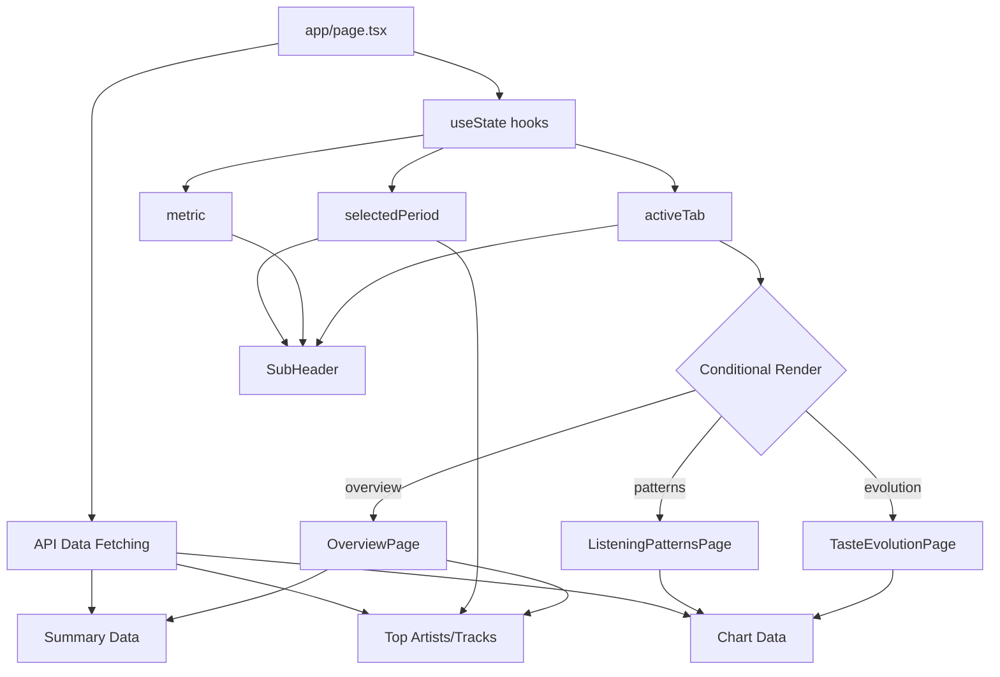

# Navigation Architecture

## Overview

The dashboard uses a **client-side tab navigation** system with three main sections, each displaying different visualizations and insights.

## Architecture Pattern

### State Management: Plain useState

The navigation and filter state is managed using React's built-in `useState` hooks in the main page component (`app/page.tsx`). This approach was chosen for its simplicity and because it perfectly meets the requirements:

- **Filter persistence across tabs**: The parent component stays mounted, so state naturally persists when switching tabs
- **Scroll position maintenance**: React re-renders don't affect browser scroll position
- **Simplicity**: No URL manipulation, no context providers, no external dependencies

```typescript
// Three simple state declarations in app/page.tsx
const [activeTab, setActiveTab] = useState<'overview' | 'patterns' | 'evolution'>('overview')
const [selectedPeriod, setSelectedPeriod] = useState<string>('all')
const [metric, setMetric] = useState<'hours' | 'plays'>('hours')
```

### Component Structure

```
app/page.tsx (Main Controller)
├── useState for tab & filters
├── Data fetching (all tabs)
└── Conditional rendering:
    ├── Header (with tab navigation)
    ├── SubHeader (conditional based on tab)
    └── Page Components:
        ├── OverviewPage
        ├── ListeningPatternsPage
        └── TasteEvolutionPage
```

## Three Dashboard Sections

### 1. Overview
**Route**: Default tab  
**Filters**: Period Selector + Metric Toggle  
**Content**:
- KPI Cards (summary stats)
- Top Artists (filtered by period)
- Top Tracks (filtered by period)

### 2. Listening Patterns
**Route**: Patterns tab  
**Filters**: Metric Toggle only  
**Content**:
- Monthly Trends Chart (all-time data)
- Day of Week Chart (all-time data)
- Hour of Day Chart (all-time data)

### 3. Taste Evolution
**Route**: Evolution tab  
**Filters**: None  
**Content**:
- Artist Evolution Chart (bump chart showing top artists over time)

## Filter Behavior

### Period Selector
- **Appears on**: Overview tab only
- **Affects**: KPI cards, top artists, top tracks
- **Options**: All Time, or specific month from available data
- **Default**: "All Time"

### Metric Toggle
- **Appears on**: Overview and Listening Patterns tabs
- **Affects**: All charts and lists
- **Options**: Hours or Plays
- **Default**: "Hours"

### Filter Persistence
When a user:
1. Sets filters on Overview tab (e.g., "December 2024", "Plays")
2. Switches to Listening Patterns tab
3. The "Plays" metric persists automatically
4. When returning to Overview, both filters are preserved

This works because the parent component (`app/page.tsx`) never unmounts during tab navigation—only the child page components swap in and out.

## UI Components

### Header Component
**Location**: `components/Header.tsx`  
**Sticky**: Yes (top: 0)  
**Contains**:
- Branding and title (left)
- Tab navigation buttons (right)
- Last updated timestamp

**Props**:
```typescript
interface HeaderProps {
  activeTab: 'overview' | 'patterns' | 'evolution'
  onTabChange: (tab: 'overview' | 'patterns' | 'evolution') => void
  lastUpdated?: string
}
```

### SubHeader Component
**Location**: `components/SubHeader.tsx`  
**Sticky**: Yes (top: 81px, below main header)  
**Contains**:
- Period selector dropdown (conditional)
- Metric toggle (conditional)

**Props**:
```typescript
interface SubHeaderProps {
  showPeriodFilter?: boolean
  showMetricFilter?: boolean
  selectedPeriod?: string
  setSelectedPeriod?: (period: string) => void
  metric?: 'hours' | 'plays'
  setMetric?: (metric: 'hours' | 'plays') => void
  availableMonths?: string[]
}
```

**Conditional Rendering**:
```typescript
// Overview: both filters
{activeTab === 'overview' && (
  <SubHeader showPeriodFilter showMetricFilter ... />
)}

// Listening Patterns: metric only
{activeTab === 'patterns' && (
  <SubHeader showMetricFilter ... />
)}

// Taste Evolution: no sub-header
```

### Page Components
**Location**: `components/pages/`  
**Type**: Presentational components  
**Purpose**: Each handles layout and composition of chart components for its section

- `OverviewPage.tsx` - Composes KPI cards and top lists
- `ListeningPatternsPage.tsx` - Composes temporal pattern charts
- `TasteEvolutionPage.tsx` - Composes artist evolution chart

## Design Decisions

### Why Client-Side Tabs?
✅ **Pros**:
- Instant navigation (no page reload)
- Simpler than Next.js App Router pages
- Single data fetch for all tabs
- Natural state persistence

❌ **Cons**:
- No deep linking to specific tabs
- No browser history for tab changes
- All data loads upfront (not an issue for this app size)

**Decision**: Client-side tabs are perfect for this use case since we don't need shareable links or browser history.

### Why useState Instead of URL Params?
✅ **Benefits**:
- Simplest possible implementation
- No URL manipulation code
- No custom hooks needed
- Scroll position naturally maintained
- Filter state automatically persists

❌ **Trade-offs**:
- State lost on page refresh (acceptable)
- Can't share specific filter settings (not needed)
- No browser back/forward (not needed)

**Decision**: Plain `useState` is the right tool for the job given the requirements.

### Why Sticky Sub-Header?
- Keeps filters accessible while scrolling through long charts
- Visual hierarchy: main header stays at top, filters below
- Clean separation of navigation (header) vs. controls (sub-header)
- Conditional rendering based on tab needs

## Data Flow



## Performance Considerations

### Re-render Optimization
- Page components are presentational and lightweight
- Data fetching happens at parent level
- Only affected components re-render on filter change
- Chart libraries (Recharts) handle their own memoization

### Could Use React.memo If Needed
```typescript
// Not needed now, but available if performance becomes an issue
export default React.memo(ListeningPatternsPage)
```

## Future Enhancements

If requirements change, easy paths to:
1. **Add URL persistence**: Swap useState for URL search params hook
2. **Add more tabs**: Just add another case in conditional rendering
3. **Add more filters**: Add to SubHeader component and pass through props
4. **Split into separate routes**: Move page components to app/(routes)

## Related Documentation

- [API Routes](./api-routes.md) - Server-side data endpoints
- [Database Architecture](./database.md) - Data storage and queries
- [Component Structure](../STRUCTURE.md) - Full component tree

