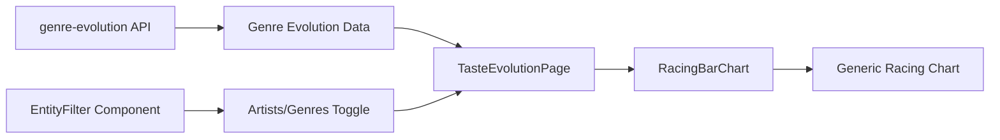

# Genre Evolution Feature

## Overview

The Genre Evolution feature adds a toggle to the Taste Evolution tab, allowing users to switch between viewing artist evolution and genre evolution in the racing bar chart. This provides a higher-level view of musical taste evolution by showing how listening time is distributed across 28 broad genre categories over time.

**Status**: Completed January 2026  
**Issue**: #1 (Genre analysis & visualization)  
**Size**: Medium (4-8 hours)

## Motivation

The original Taste Evolution tab only showed artist rankings over time. While insightful, this granular view (thousands of artists) didn't easily reveal broader patterns in musical taste. By adding genre evolution:

- Users can see macro trends (e.g., shifting from Rock to Jazz to Hip Hop)
- The 28 broad genre categories provide meaningful clustering (vs 452+ subgenres)
- The cumulative approach shows how lifetime listening patterns evolve
- The toggle provides flexibility to zoom between artist-level and genre-level views

## Technical Implementation

### Architecture



### Key Design Decisions

#### 1. Broad Genres vs Subgenres

**Decision**: Use the 28 broad genre categories from `genre_mappings` table

**Rationale**:
- 452 subgenres are too granular for meaningful visualization
- Top 10 chart would only show niche subgenres (e.g., "folk rock", "classic rock", "psychedelic rock" all competing)
- 28 categories provide the right level of abstraction for pattern recognition
- Existing infrastructure (`genre_mappings` table) already maps subgenres to broad categories

#### 2. All-Time Cumulative Calculation

**Decision**: Match the artist evolution approach with all-time cumulative totals

**Rationale**:
- Consistency with artist evolution UX
- Shows lifetime listening patterns evolving over time
- Avoids volatility of monthly snapshots
- More meaningful for understanding taste trajectory

**Query Approach**:
```sql
WITH monthly_genre_data AS (
  -- Aggregate listening by month and genre
  SELECT year_month, COALESCE(broad_genre, subgenre) AS genre,
         SUM(ms_played) AS ms, COUNT(*) AS plays
  FROM plays JOIN artists JOIN genre_mappings
  GROUP BY year_month, genre
),
cumulative_totals AS (
  -- Calculate cumulative sums using spine approach
  SELECT year_month, genre,
         SUM(hours) OVER (PARTITION BY genre ORDER BY year_month) AS cumulative_hours
  FROM monthly_genre_data
)
SELECT * FROM cumulative_totals
```

#### 3. Generic RacingBarChart Component

**Decision**: Refactor `RacingBarChart` to accept generic `name` field instead of `artist_name`

**Rationale**:
- Avoids code duplication (one chart component for both views)
- Separation of concerns: chart handles visualization, page handles data transformation
- Easy to extend to other entity types in future (albums, tracks, etc.)
- Simpler maintenance

**Interface Changes**:
```typescript
// Before
interface ArtistData {
  artist_name: string
  // ...
}

// After
interface DataPoint {
  name: string  // Generic field
  // ...
}
```

#### 4. Independent Filter State

**Decision**: Entity toggle (artists/genres) is independent of metric toggle (hours/plays)

**Rationale**:
- Users may want to explore all combinations (artist hours, artist plays, genre hours, genre plays)
- State persists when switching tabs (standard behavior)
- Each filter has clear, independent effect on visualization

### Components Created

#### 1. EntityFilter Component

**Location**: `components/filters/EntityFilter.tsx`

**Purpose**: Toggle button to switch between Artists and Genres

**Design**: Matches existing `MetricFilter` styling for consistency
- Spotify green for active state
- Gray with hover effect for inactive
- Rounded full button group

#### 2. Genre Evolution API Endpoint

**Location**: `app/api/genre-evolution/route.ts`

**Query Performance**:
- Joins three tables: `plays` → `artists` → `genre_mappings`
- Uses `UNNEST(STRING_SPLIT())` to expand comma-separated genres
- Spine approach for efficient cumulative calculation
- Expected query time: ~100-150ms (similar to artist-evolution)

**Response Format**:
```json
{
  "data": [
    {
      "year_month": "2024-01",
      "genre": "Rock",
      "hours": 145.23,
      "plays": 2341
    }
  ]
}
```

### Data Flow

1. **User toggles to "Genres"** in TasteEvolutionPage
2. **Entity state updates** in `app/page.tsx`
3. **TasteEvolutionPage receives** both `artistEvolution` and `genreEvolution` data
4. **Data normalization** maps entity-specific fields to generic `name` field:
   ```typescript
   const data = entity === 'artists' 
     ? artistEvolution.map(d => ({ ...d, name: d.artist_name }))
     : genreEvolution.map(d => ({ ...d, name: d.genre }))
   ```
5. **RacingBarChart renders** with normalized data and `entityType` prop
6. **Chart title updates** dynamically: "Artist Evolution" vs "Genre Evolution"

## Genre Mapping System

The feature leverages the existing genre mapping infrastructure:

- **Source**: Artist genres from Spotify API enrichment
- **Mapping Table**: `genre_mappings` (created by `seed_genre_mappings.py`)
- **Categories**: 28 broad genres covering 452+ subgenres
- **Coverage**: ~94% reduction in genre count for better visualization

**Example Mappings**:
- "folk rock", "classic rock", "psychedelic rock" → "Rock"
- "indie rock", "indie folk", "indie pop" → "Indie/Alternative"
- "neo soul", "motown", "soul" → "Soul/R&B"

See [Genre Mappings Guide](../guides/genre-mappings.md) for complete details.

## User Experience

### Before
- Only artist evolution available
- No way to see genre trends

### After
- Toggle between Artists and Genres
- Same animation and controls work for both
- Clear visual distinction via chart title
- Filter state persists across tab switches

### Animation Behavior
- Same racing bar chart animation (600ms frames, 450ms transitions)
- Keyboard shortcuts work identically (arrow keys, spacebar)
- Play/pause/reset controls
- Progress bar and month display

## Edge Cases Handled

1. **Missing Genre Data**: Uses `COALESCE(broad_genre, subgenre)` to handle unmapped genres
2. **Multiple Genres per Artist**: `UNNEST` properly distributes listening time across all genres
3. **Null Genres**: `WHERE a.genres IS NOT NULL` filters out unenriched artists
4. **Empty Months**: Spine approach ensures all months present with zero values
5. **Loading States**: Genre evolution fetched independently, doesn't block other data

## Testing Considerations

- ✅ Toggle switches smoothly without lag
- ✅ Chart animations work for both entity types
- ✅ Metric toggle works independently of entity toggle
- ✅ All 28 broad genres appear (no missing categories)
- ✅ Cumulative totals match expected values
- ✅ Keyboard controls work in both modes
- ✅ Chart title updates correctly
- ✅ Filter state persists when switching tabs

## Performance

### API Response Times (Local DuckDB)
- Artist Evolution: ~100ms
- Genre Evolution: ~120ms (slightly slower due to JOIN complexity)
- Both are acceptable for user experience

### Bundle Size Impact
- EntityFilter: ~1KB
- Type definitions: negligible
- No additional dependencies

### Optimization Opportunities
- Could cache API responses with Next.js `revalidate`
- Could precompute genre mappings during ingestion
- Could add loading skeleton for smoother perceived performance

## Future Enhancements

Potential additions building on this foundation:

1. **Album Evolution**: Toggle to show top albums
2. **Decade Evolution**: Show music by release decade
3. **Combined View**: Side-by-side artist and genre charts
4. **Export**: Download evolution data as CSV
5. **Filters**: Add time range filter to focus on specific periods

## Related Documentation

- [Genre Mappings Guide](../guides/genre-mappings.md) - Understanding the 28 categories
- [API Routes](../architecture/api-routes.md) - Genre evolution endpoint reference
- [Navigation Architecture](../architecture/navigation.md) - Filter state management
- [Artist Evolution Archive](./ARTIST_EVOLUTION.md) - Original racing chart implementation

## Lessons Learned

1. **Reusability pays off**: Refactoring RacingBarChart to be generic was straightforward and avoids duplication
2. **Existing infrastructure**: Genre mappings table made this feature easy to implement
3. **Consistent patterns**: Following existing filter component patterns (MetricFilter) speeds development
4. **State management**: Plain useState continues to work well even with additional filters
5. **Documentation value**: Clear architecture docs make feature additions smoother

---

**Implementation Date**: January 2026  
**Author**: Jacob Beallor  
**Status**: Completed ✅

